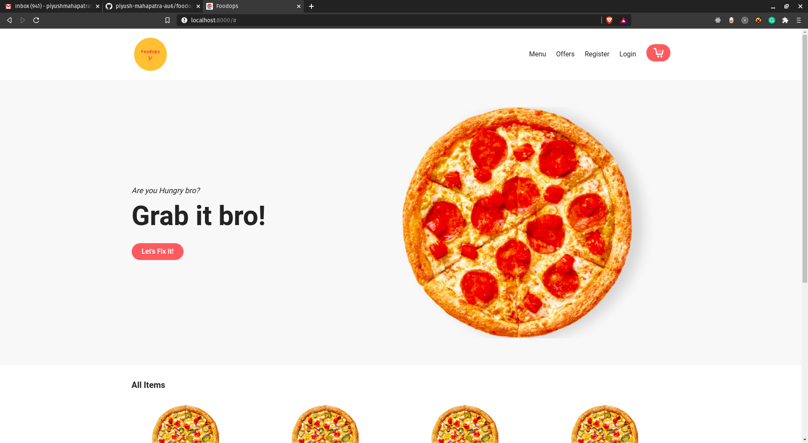

# Foodops - _Safe Food,Swift Delivery_

- This is a Food-Delivery Web Application built in Nodejs-ExpressJS and with Server-Side rendering with EJS and MongoDB as Database.
- SocketIO library is being used to setup real-time Update on Delivery and
- This Project is under Construction,Would be completed by this Week

# Tech Stack

### Backend:

- NodeJS-express
- MongoDB
- Passport JS
- SocketIO

### Frontend:

- EJS Template Engine
- Tailwind CSS
- Webpack Wrapper
